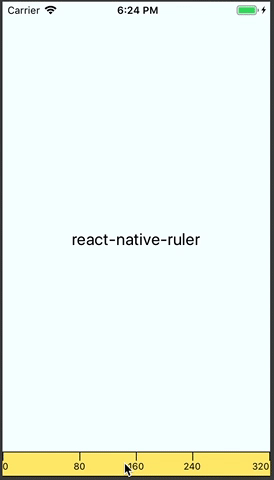

# react-native-ruler

[](https://badge.fury.io/js/react-native-ruler)

📏 A devtool for measuring pixel dimensions on your React Native screens



This is a proof of concept I threw together on a flight. Eventual plans are to integrate within the devtools menu, support rotating the device, allow the bars to be on any of the 4 sides of the device, etc..

Happy to take PRs or suggestions.

## Getting Started

### Installing

`npm install react-native-ruler`

### Usage

```js
// first, import the component
import { RNRuler } from 'react-native-ruler';

// then drop it on any screen in your app (or in the root)
<RNRuler />;
```

-   Tap the bottom right corner of the ruler (or two-finger tap the bar) to swap between axis

## License

react-native-ruler is [MIT licensed](https://github.com/lfkwtz/react-native-ruler/tree/master/LICENSE)
